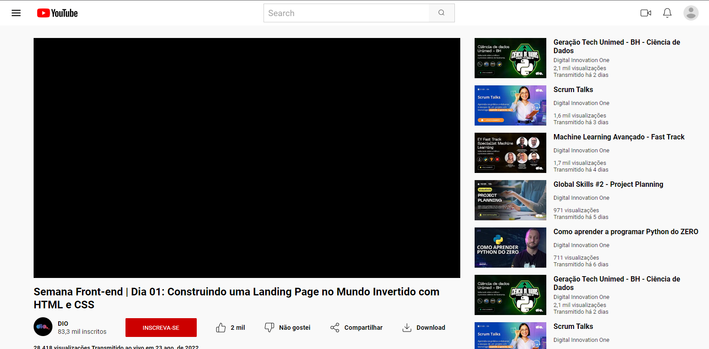

# Desafio de Flexbox - DIO: Clone da Página do Youtube

[Clique aqui](https://ferrgusttavo.github.io/css-clone-youtube/) para acessar o resultado final do clone da Página do Youtube criada a partir do desafio!

Neste Desafio você colocará a mão na massa e irá clonar a página do YouTube com CSS colocando em prática todos os conceitos aprendidos, principalmente sobre Flexbox.

[Link do Figma](https://www.figma.com/file/lrRWUZPKnqMDZrSDJmZxUS/Desafio-de-Flexbox---DIO?type=design&node-id=0-1&t=XcGDAgwwovWMTgq4-0) contendo o protótipo do desafio que usei para me basear.

